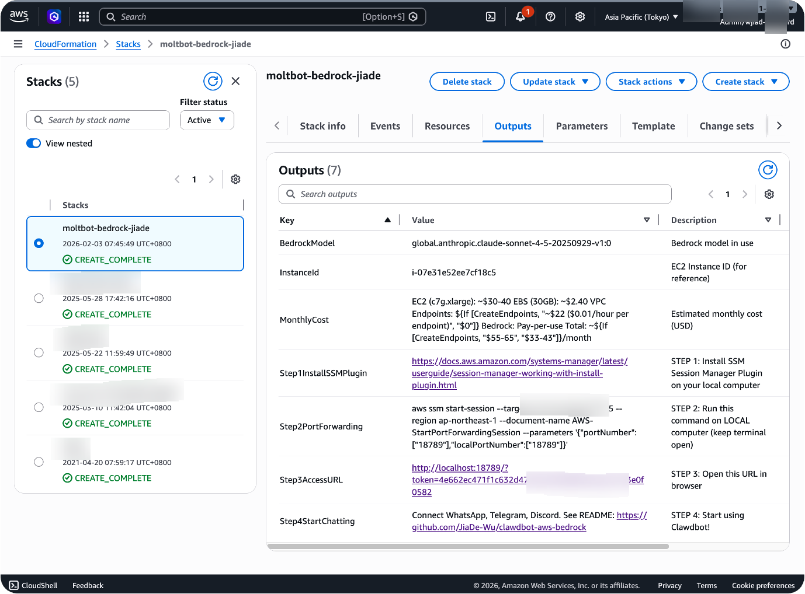

# OpenClaw on AWS with Bedrock

> Your own AI assistant on AWS — connects to WhatsApp, Telegram, Discord, Slack. Powered by Amazon Bedrock. No API keys. One-click deploy. ~$40/month.

English | [简体中文](README_CN.md)

[](https://opensource.org/licenses/MIT)
[](https://aws.amazon.com/bedrock/)
[](https://aws.amazon.com/cloudformation/)

---

## 🎯 Deployment Options

| Mode | Description | Guide | Use Case |
|------|-------------|-------|----------|
| **🦞 Single-User** | Personal AI assistant (recommended) | **[→ Quick Start Guide](SINGLE_USER_GUIDE.md)** | Individual use, ~$45-65/month |
| 🏢 Multi-Tenant | Enterprise platform with AgentCore | [Advanced Guide](README_AGENTCORE.md) | Organizations, multiple users |

> **Most users want Single-User mode** — it's simpler, cheaper, and fully featured. Start there unless you need enterprise multi-tenancy.

---

## Why This Exists

[OpenClaw](https://github.com/openclaw/openclaw) is the fastest-growing open-source AI assistant — it runs on your hardware, connects to your messaging apps, and actually does things: manages email, browses the web, runs commands, schedules tasks.

The problem: setting it up means managing API keys from multiple providers, configuring VPNs, and handling security yourself.

This project solves that. One CloudFormation stack gives you:

- **Amazon Bedrock** for model access — 10 models, one unified API, IAM authentication (no API keys)
- **Graviton ARM instances** — 20-40% cheaper than x86
- **SSM Session Manager** — secure access without opening ports
- **VPC Endpoints** — traffic stays on AWS private network
- **CloudTrail** — every API call audited automatically

Deploy in 8 minutes. Access from your phone.

---

## 🚀 Quick Start (Single-User)

**Full guide with troubleshooting: [SINGLE_USER_GUIDE.md](SINGLE_USER_GUIDE.md)**

### One-Click Deploy

1. Click "Launch Stack" for your region
2. Select an EC2 key pair (optional)
3. Wait ~8 minutes
4. Check the Outputs tab

| Region | Launch |
|--------|--------|
| **US West (Oregon)** | [](https://console.aws.amazon.com/cloudformation/home?region=us-west-2#/stacks/create/review?stackName=openclaw-bedrock&templateURL=https://sharefile-jiade.s3.cn-northwest-1.amazonaws.com.cn/clawdbot-bedrock.yaml) |
| **US East (Virginia)** | [](https://console.aws.amazon.com/cloudformation/home?region=us-east-1#/stacks/create/review?stackName=openclaw-bedrock&templateURL=https://sharefile-jiade.s3.cn-northwest-1.amazonaws.com.cn/clawdbot-bedrock.yaml) |
| **EU (Ireland)** | [](https://console.aws.amazon.com/cloudformation/home?region=eu-west-1#/stacks/create/review?stackName=openclaw-bedrock&templateURL=https://sharefile-jiade.s3.cn-northwest-1.amazonaws.com.cn/clawdbot-bedrock.yaml) |
| **Asia Pacific (Tokyo)** | [](https://console.aws.amazon.com/cloudformation/home?region=ap-northeast-1#/stacks/create/review?stackName=openclaw-bedrock&templateURL=https://sharefile-jiade.s3.cn-northwest-1.amazonaws.com.cn/clawdbot-bedrock.yaml) |

> **Prerequisites**: Enable Bedrock models in the [Bedrock Console](https://console.aws.amazon.com/bedrock/) and create an EC2 key pair in your target region (optional, for SSH access).

### After Deployment



> 🦞 **Just open the Web UI and say hi.** All messaging plugins (WhatsApp, Telegram, Discord, Slack, Feishu) are pre-installed. Tell your OpenClaw which platform you want to connect — it will guide you through the entire setup step by step. No manual configuration needed.

**Quick Access:**

```bash
# 1. Install SSM Session Manager Plugin (one-time)
#    https://docs.aws.amazon.com/systems-manager/latest/userguide/session-manager-working-with-install-plugin.html

# 2. Start port forwarding (keep terminal open)
aws ssm start-session \
  --target i-YOUR_INSTANCE_ID \
  --region YOUR_REGION \
  --document-name AWS-StartPortForwardingSession \
  --parameters '{"portNumber":["18789"],"localPortNumber":["18789"]}'

# 3. Open in browser (get token from CloudFormation Outputs)
open "http://localhost:18789/?token=YOUR_TOKEN"
```

**📖 Complete guide:** [SINGLE_USER_GUIDE.md](SINGLE_USER_GUIDE.md)
- Step-by-step setup
- Connect Telegram/WhatsApp/Discord/Slack
- Troubleshooting common issues
- Backup and maintenance
- Cost optimization

---

## 🛠️ Maintenance Scripts

Useful scripts for managing your deployment:

```bash
# Clone repository
git clone https://github.com/MakerHe/OpenClaw-AWS-Bedrock.git
cd OpenClaw-AWS-Bedrock

# Run health check
./scripts/health-check.sh

# Backup configuration and workspace
./scripts/backup.sh

# More scripts available in scripts/ directory
ls scripts/
```

**Available scripts:**
- `health-check.sh` - System and OpenClaw health monitoring
- `backup.sh` - Backup config, workspace, create AMI
- (More scripts coming soon)

---

## 📊 Architecture

### Single-User Mode

```
You (Telegram/WhatsApp/Discord/Slack)
  ↓
OpenClaw Gateway (EC2)
  ↓
Amazon Bedrock (Claude/Nova models)
  ↓
Response back to you
```

**Key components:**
- EC2 instance (t4g.large, Graviton ARM64)
- OpenClaw Gateway (manages messaging connections)
- VPC Endpoints (private AWS network access)
- Amazon Bedrock (10+ models)

### Multi-Tenant Mode (Advanced)

For enterprise deployments with multiple isolated users, see [README_AGENTCORE.md](README_AGENTCORE.md).

---

## 💰 Cost Estimate (Single-User)

| Item | Monthly Cost (USD) |
|------|--------------------|
| EC2 (t4g.large, Graviton ARM64) | $20-40 |
| EBS (30GB) | $2.40 |
| VPC Endpoints (5 × $0.01/hour) | $29 |
| Bedrock (pay-per-use) | Variable |
| **Total** | **~$45-65/month** |

💡 **Tip:** Graviton ARM64 instances are 20-40% cheaper than x86 equivalents with same performance.

**Cost optimization:**
- Stop EC2 when not in use
- Use t4g.medium for lighter workloads
- Monitor Bedrock usage in CloudWatch

---

## 🔒 Security Features

- ✅ **No API Keys** - Uses AWS IAM for Bedrock authentication
- ✅ **Private Network** - VPC Endpoints keep traffic on AWS private network
- ✅ **Secure Access** - SSM Session Manager, no SSH ports open by default
- ✅ **Auditable** - CloudTrail logs every Bedrock API call
- ✅ **Encrypted** - Data at rest and in transit encrypted
- ✅ **Minimal Permissions** - IAM role with least-privilege access

**Security best practices:**
- Run security audit: `openclaw security audit --deep`
- Enable UFW firewall (see [SINGLE_USER_GUIDE.md](SINGLE_USER_GUIDE.md))
- Schedule periodic audits

---

## 📱 Connect Messaging Platforms

OpenClaw supports multiple messaging platforms simultaneously:

### Telegram (Easiest)
1. Open Web UI
2. Say: "Connect to Telegram"
3. Follow guided setup
4. Done!

### WhatsApp
1. Say: "Connect to WhatsApp"
2. Scan QR code
3. Start chatting!

### Discord / Slack / Feishu
Similar guided setup — just ask OpenClaw!

**Full instructions:** [SINGLE_USER_GUIDE.md - Connect Your Apps](SINGLE_USER_GUIDE.md#connect-your-apps)

---

## 🎯 Deploy with Kiro AI

Prefer a guided, conversational deployment experience? [Kiro](https://kiro.dev/) can help you deploy and configure OpenClaw step-by-step.

**[→ Kiro Deployment Guide](QUICK_START_KIRO.md)**

---

## 📚 Documentation

| Document | Description |
|----------|-------------|
| **[SINGLE_USER_GUIDE.md](SINGLE_USER_GUIDE.md)** | Complete single-user deployment guide |
| [README_AGENTCORE.md](README_AGENTCORE.md) | Enterprise multi-tenant architecture |
| [DEPLOYMENT.md](DEPLOYMENT.md) | Detailed deployment options |
| [TROUBLESHOOTING.md](TROUBLESHOOTING.md) | Common issues and solutions |
| [QUICK_START_KIRO.md](QUICK_START_KIRO.md) | Kiro AI deployment guide |
| [CLAUDE.md](CLAUDE.md) | Claude model configuration |

---

## 🤝 Contributing

Contributions welcome! Please read [CONTRIBUTING.md](CONTRIBUTING.md) first.

**Areas we'd love help with:**
- Testing on different AWS regions
- Documentation improvements
- Bug reports and fixes
- New messaging platform integrations
- Cost optimization strategies

---

## 📝 License

This project is licensed under the MIT License - see the [LICENSE](LICENSE) file for details.

---

## 🙏 Acknowledgments

- [OpenClaw](https://github.com/openclaw/openclaw) - The amazing open-source AI assistant
- [Amazon Bedrock](https://aws.amazon.com/bedrock/) - For providing unified model access
- All contributors and users!

---

## ⭐ Star History

If this project helped you, please consider giving it a star! ⭐

---

## 📧 Support

- **Documentation:** [docs.openclaw.ai](https://docs.openclaw.ai)
- **Community:** [OpenClaw Discord](https://discord.com/invite/clawd)
- **Issues:** [GitHub Issues](https://github.com/MakerHe/OpenClaw-AWS-Bedrock/issues)

---

**Ready to deploy?** → **[Start with Single-User Guide](SINGLE_USER_GUIDE.md)** 🦞
